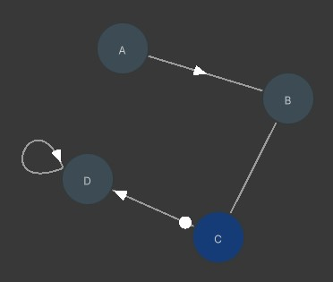

# Level Design

A Unity implementation of https://zhuanlan.zhihu.com/p/415025159

# Environment

Unity: 2022.1.0b16+

# 如何使用

## Graph格式

例：

_sample.txt_

```
A>>B
B--C
C*>D
D->D
```

代表下图



### 连接符

符号|含义|英文
---|---|---
`--`|全连通路径|Undirected Path
`->`|单向路|Directed Path
`>>`|单向门|Shortcut
`*>`|机关门|Mechanism

## 图形化操作

1. 打开 Window/Level Designer <kbd>Shift</kbd>+<kbd>1</kbd> 工具
2. 点击`打开`并选择你的txt文件
3. 计算3阶稳定因子
